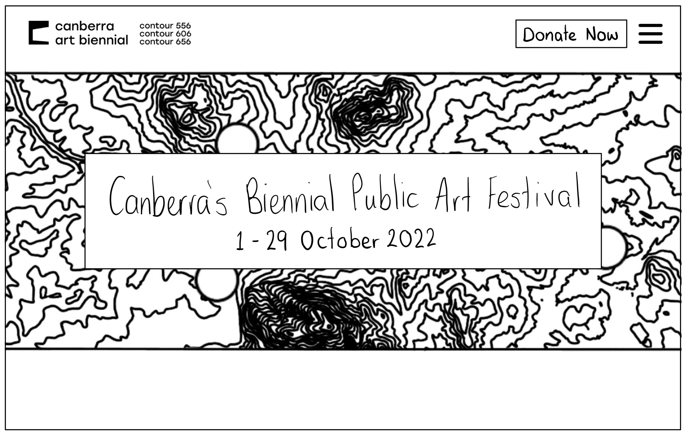
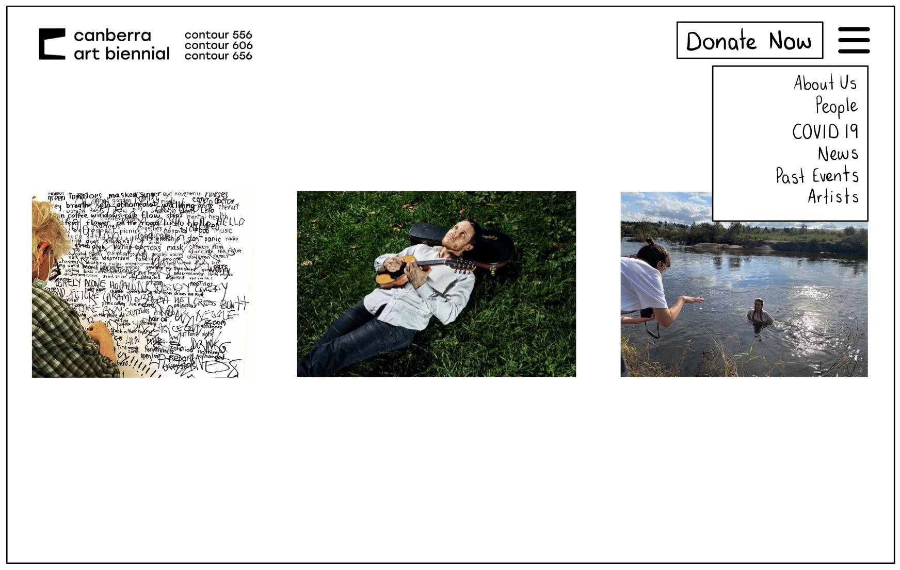
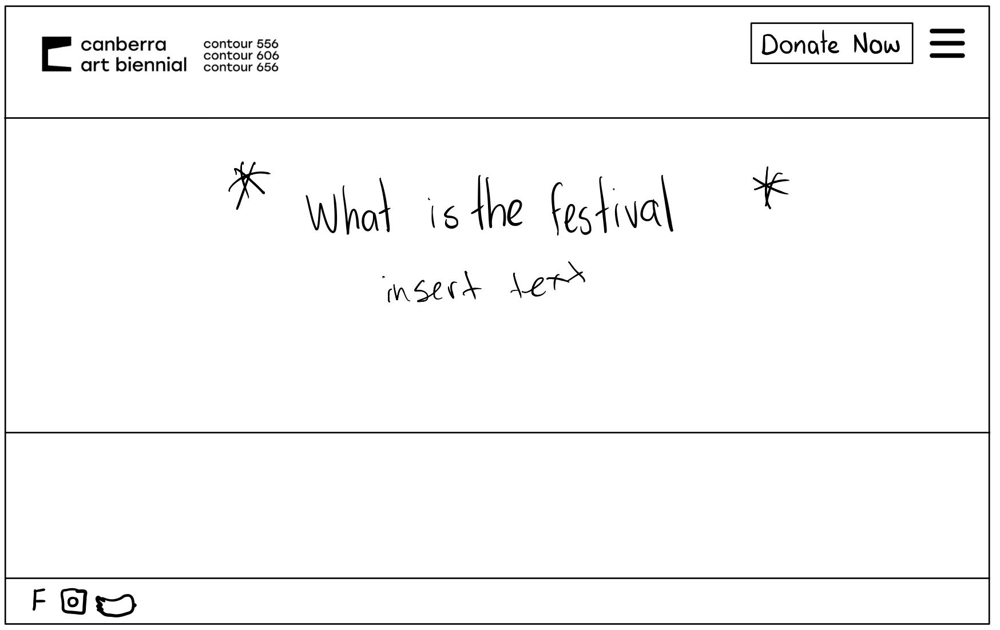
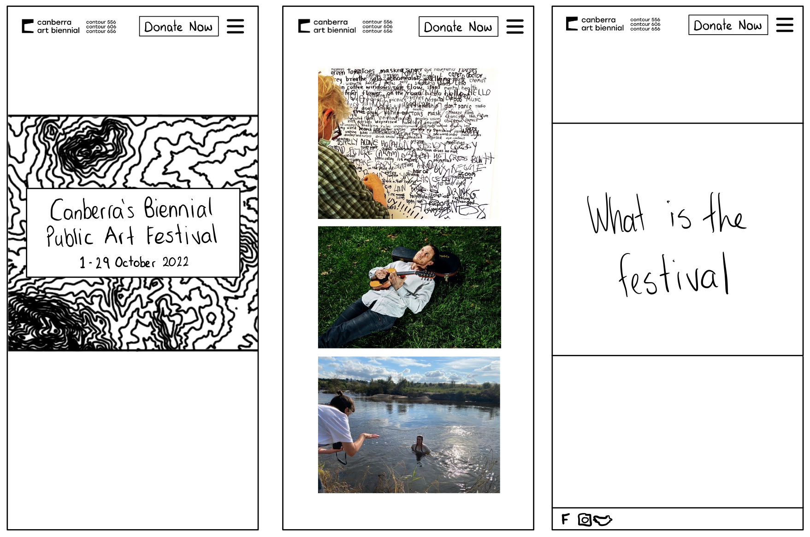

# Front-end Web Design: Project 1
This website is a remix of the Contour 556 website for the Canberra Art Biennial. Aside from displaying the required coding techniques, the aim of this redesign was to enhance the clarity of the website's purpose. 
## Low Fidelity Prototype
The main design changes to the website were what content is included on the home page. The first text on the page is 'Canberra's Biennial Public Art Festival' - a to the point explanation of what the event is since the name Contour 556 was replaced. Although there is a call back to the original name with the title banner being a hand drawing of the topographical contour lines of Lake Burley Griffin (Contour 556), National Arboretum (Contour 656), and University of Canberra (Contour 606).

Since the event is about art I wanted to centre on the three artists commissioned for the event. The next thing users see after the title banner is images introducing the artists. Users can also gain more information about the artists by hovering over the image. 

When assessing the design on different scales the biggest change I made was to alter the artist images to appear from horizontal to vertical on smaller screens. In addition to this I made the text size change in relation to the screen size. 

These design changes are all reflected in the low fidelity prototypes shown below:

 
     
     
     

The low fidelity prototype was almost entirely implemented in the website. The main change is the navigation bar being visible rather than hidden in a drop down menu. The navigation only changes to a drop down menu when the screen is a smaller size to further show the responsiveness. I also decided not to add the donate button as I ran out of time. 

## Reflection
This project aimed to create a reactive website that worked on desktop, tablet, and mobile. Overall I believe it was a good result, with reactive sizing giving a good view for tablet and desktop and using a media query to change things significantly for the mobile view.

### Grids and Flexboxes
For this project I had to improve my understanding of grids and flexboxes. I found that grids were best for creating the spacing between sets of objects, and that flexboxes were best for handling sets of items like images and page links. 

### Relative sizing - text, padding, and images
I learned through the process that sizing text, images, and padding manually was clumbersome and required additional media queries. I found that it was more efficient to use rem sizing for text, percentage sizing for images, and using percentage padding. 

### Tablet and Desktop
I found that I could avoid using another media query by using the relative sizing above as the tablet didn't warrant its own sizing. 

### Header & Dropdown
The header and the dropdown required the most work to look good on mobile, the text and images became too small using the relative sizing described above. By using a flexbox, changing the grid proportions, and some styling to make new items appear and disappear, I created a new header layout that was sized much better.

A challenge was dealing with image sizing, where it didn't inherit the sizing of the container. I couldn't overcome this challenge and thought it was secondary to the primary aims of the assignment.

### Images
The images became much too small for mobile when laid out the same as the desktop, so by manipulating the size and flexbox layout I created a column of better sized images. 

### Footer
The footer needed to be resized for mobile as the icons became too small. So the grid and flexbox were manipulated to give the icons more room and prioritise them.

Additionally, the flexbox didn't behave as expected with the images with some strange styling. Again this wasn't fixed due to time constraints and prioritisation

### Polish and additional pages
I would have liked to add additional pages, add some font styling, add links to the social media icons, and do little changes of padding and sizing to give a more refined product. 

## Resources
https://css-tricks.com/rems-ems/
>Helpful in text resizing

https://css-tricks.com/fun-viewport-units
>Viewport units

https://css-tricks.com/snippets/css/complete-guide-grid/
>Very comprehensive guide to grids and essential to this project

https://developer.mozilla.org/en-US/docs/Web/CSS/CSS_Grid_Layout/Basic_Concepts_of_Grid_Layout
>Another grid guide with great examples

https://www.w3schools.com/howto/howto_css_responsive_text.asp
>Great text resizing examples